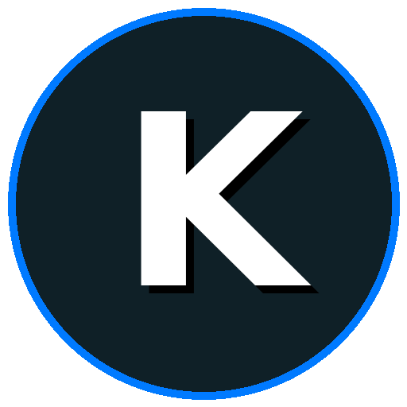

# 🧠 KORTEX NEXUS (v1.0 Gold)

> **"Transforma cualquier PC antigua en una Estación de Trabajo con IA."**



**Kortex Nexus** es una Suite de Productividad diseñada específicamente para revivir equipos de bajos recursos (<2GB RAM). A diferencia de los navegadores modernos que consumen toda tu memoria, Kortex utiliza una arquitectura modular para ofrecer Inteligencia Artificial, Automatización y Navegación Web sin colapsar tu sistema.

## 🚀 Características Principales

- **🧠 Cerebro Nexus (Gemini 2.5):** Asistente de IA integrado que responde, programa y redacta por ti.
- **🗣️ Modo Jarvis (Voz y Oído):** Habla con tu PC y escucha las respuestas en tiempo real (STT/TTS).
- **🌐 Kortex Browser Pro:** Un navegador basado en Chromium puro (QtWebEngine), optimizado para cargar Canva, Q10 y YouTube sin rastreadores ni consumo excesivo de RAM.
- **🚀 Launcher Dinámico:** Panel de accesos directos personalizable. Tus apps favoritas a un clic.
- **📊 Monitor de Sistema:** Visualización en tiempo real de CPU y RAM para evitar cuellos de botella.
- **🎵 Radio Nexus:** Reproductor de música (YouTube Audio) sin anuncios y en segundo plano.

## 🛠️ Tecnologías

- **Core:** Python 3.x
- **UI:** CustomTkinter (Modern GUI)
- **Browser Engine:** PyQt6 WebEngine (Chromium)
- **AI:** Google Gemini API
- **Audio:** MPV + SpeechRecognition

## 📦 Instalación

```bash
# 1. Clonar el repositorio
git clone [https://github.com/ortiz10m/KortexNexus.git](https://github.com/ortiz10m/KortexNexus.git)
cd KortexNexus

# 2. Crear entorno virtual (Recomendado)
python3 -m venv venv
source venv/bin/activate

# 3. Instalar dependencias
pip install -r requirements.txt

# 4. Configurar tu Llave de IA
# Crea un archivo .env en la carpeta y pega tu API Key de Google Gemini:
# GEMINI_API_KEY=tu_clave_aqui

# 5. Ejecutar Kortex
python3 main.py

## 📄 Licencia
Este proyecto está bajo la Licencia MIT.
**Propiedad Intelectual de David (Founder) - 2026.**
